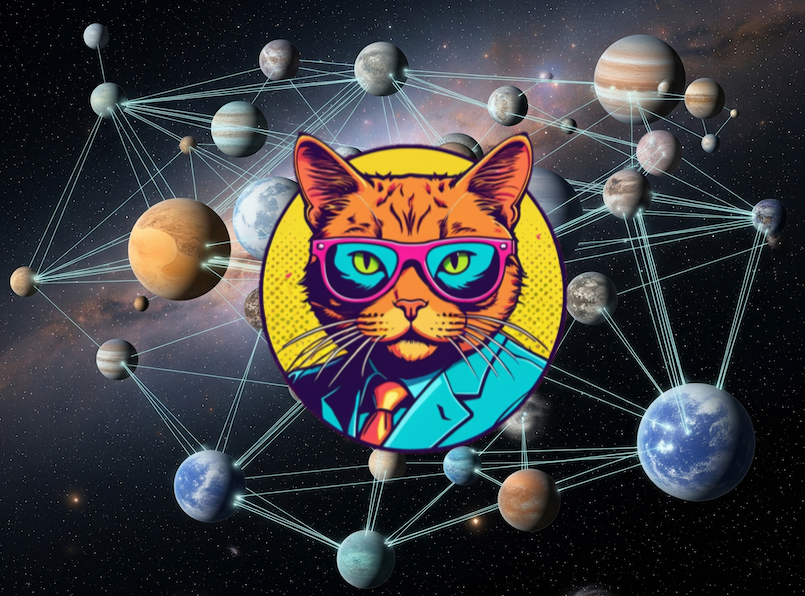

<div align="center">
    <h1 style="text-align: center;">UNaIVERSE</h1>
    
</div>

*Welcome to a new "UN(a)IVERSE," where humans and artificial agents coexist, interact, learn from each other, grow together, in a privacy and low-energy oriented reality.*

UNaIVERSE is a project framed in the context of [Collectionless AI](https://collectionless.ai), our perspective on Artificial Intelligence rooted on **privacy**, **low energy consumption**, and, more importantly, a **decentralized** model.

UN(a)IVERSE is a **peer-to-peer network**, aiming to become the new incarnation of the Web, combining (in the long run) the principles of Social Networks and AI under a **privacy** lens—a perspective that is crucial given how the Web, especially Social Networks, and AI are used today by both businesses and individual users.

- Enter UNaIVERSE: [**UNaIVERSE portal (login/register)**](https://unaiverse.io)
- Read more on our ideas: [**Collectionless AI website**](https://collectionless.ai)

---

## 🚀 Features

- Python interface to implement your own agents ([PyTorch modules](https://pytorch.org/)): easy to let existing PyTorch models enter UNaIVERSE, but have a look at how to make them enter your own, fully customized **world**!
- You can design **worlds** and formalize the behaviour of agents living there, with different **roles**.
- The same agent can enter a world, live there for a while, leave the world and join another, without changing your code.
- Are you a researcher? This is perfect to study models that learn over time (Lifelong/Continual Learning), and social dynamics of different categories of models! Feel free to propose novel ideas to exploit UNaIVERSE in your research!
- Are you in the industry or, more generally, business oriented? **Think about privacy-oriented solutions that we can build over this new UN(a)IVERSE!**

---

## ⚡ Status

- Very first version: we think it will always stay beta 😎, but right now there are many features we plan to add and several parts to improve, **thanks to your feedback!**
- Missing features (work-in-progress): browser-to-browser communication; agents running on mobile; actual social network features (right now it is very preliminary, not really showcasing where we want go)  

---

## 📦 Installation

```bash
pip install unaiverse
```

That's it. Of course, if you want to dive into details, you find the source code here in this repo.

---

## 🛠 Mini Tutorial

The simplest usage you can think of is the one which does not exploit the real features of UNaIVERSE, but it is so simple that is a good way to put you in touch with UNaIVERSE itself. 

You can **showcase** your PyTorch networks (actually, it can be every kind of model son of the PyTorch [*torch.nn.Module*](https://docs.pytorch.org/docs/stable/generated/torch.nn.Module.html) class) as follows. Let's focus on ResNet for simplicity.

Alright, let's discuss the code in the [assets/tutorial](./assets/tutorial) folder of this repo, composed of numbered scripts.

### Step A1. Do you known how to set up a network in PyTorch?

Let us set up a ResNet50 in the most basic PyTorch manner. The code is composed of a **generator of tensors** interpreted as a pictures (actually, an ugly tensor with randomly colored pixels) and a pretrained **resnet classifier** which classifies the pictures generating a probability distribution over 1,000 classes. Try to run the first script from the [assets/tutorial](./assets/tutorial) folder. We report it here, carefully read the comments!

```python
import torch
import torchvision

# Downloading PyTorch module (ResNet)
net = torchvision.models.resnet50(weights="IMAGENET1K_V1").eval()

# Generating a random image (don't care about it, it is just a toy example,
# think it is a nice image!)
inp = torch.rand((1, 3, 224, 224), dtype=torch.float32)

# Inference: expects as input a tensor of type torch.float32, custom width and
# height, but 3 channels and batch dimension must be there; the output is a
# tensor with shape (1, 1000), i.e., a tensor in which batch dimension is
# present and then 1000 elements.
out = net(inp)

# Print shapes
print(f"Input shape: {tuple(inp.shape)}, dtype: {inp.dtype}")
print(f"Output shape: {tuple(out.shape)}, dtype: {out.dtype}")
```

### Step A2. Let's create UNaIVERSE agents!

We are going to create two agents, **independently running and possibly located in different places/machines**. 
- One is based on the **resnet classifier**, waiting to be asked (by some other agents) for a prediction about a given image.
- The other is the **generator of tensors**, ready to generate a tensor (representation of a picture) and ask another agent to classify it.

Here is the **resnet classifier** agent, running forever and waiting for somebody to ask for a prediction, taken from script 2 in the [assets/tutorial](./assets/tutorial) folder:

```python
import torch
import torchvision
from unaiverse.agent import Agent
from unaiverse.dataprops import Data4Proc
from unaiverse.networking.node.node import Node

# Downloading PyTorch module (ResNet)
net = torchvision.models.resnet50(weights="IMAGENET1K_V1").eval()

# Agent: we pass the network as "processor".
# Check the input and output properties of the processor, they are coherent with the
# input and output shapes of ResNet; here "None" means "whatever, but this axis must be
# there!". By default, this agent will act as a serving "lone wolf", serving whoever asks for
# a prediction.
agent = Agent(proc=net,
              proc_inputs=[Data4Proc(data_type="tensor", tensor_shape=(None, 3, None, None),
                                     tensor_dtype=torch.float32)],
              proc_outputs=[Data4Proc(data_type="tensor", tensor_shape=(None, 1000),
                                      tensor_dtype=torch.float32)])

# Node hosting agent: a node will be created in your account with this name, if not
# existing; it is "hidden" meaning that only you can see it in UNaIVERSE (since it is
# just a test!); the clock speed can be tuned accordingly to your needed and computing
# power.
node = Node(node_name="ResNetAgent", hosted=agent, hidden=True, clock_delta=1. / 30.)

# Running node (forever)
node.run()
```

Run it. Now, here is the agent capable of **generating tensors** (let's say images), which is asked to get in touch with the resnet agent, taken from script 3 in the [assets/tutorial](./assets/tutorial) folder:

```python
import torch
from unaiverse.agent import Agent
from unaiverse.dataprops import Data4Proc
from unaiverse.networking.node.node import Node


# Custom generator network: a module that simpy generate an image with
# "random" pixel intensities; we will use this as processor of our new agent.
class Net(torch.nn.Module):
    def __init__(self):
        super().__init__()

    # The input will be ignored, and a default None value is needed
    def forward(self, x: torch.Tensor | None = None):
        inp = torch.rand((1, 3, 224, 224), dtype=torch.float32)
        print(f"Generated data shape: {tuple(inp.shape)}, dtype: {inp.dtype}")
        return inp


# Agent: we use the generator as processor.
# This agent will still be a "lone wolf", but we will force a different behaviour, that is
# the one of "asking" another agent to handle the generated data, getting back a response.
agent = Agent(proc=Net(),
              proc_inputs=[Data4Proc(data_type="all")],  # Able to get every type of data (since it won't use it :))
              proc_outputs=[Data4Proc(data_type="tensor", tensor_shape=(1, 3, 224, 224),
                                      tensor_dtype="torch.float32")],  # These are the properties of generator output
              behav_lone_wolf="ask")  # Setting this behavior: "ask the partner to respond to your generated data"

# Node hosting agent
node = Node(node_name="GeneratorAgent", hosted=agent, hidden=True, clock_delta=1. / 30.)

# Telling this agent to connect to the ResNet one
node.ask_to_get_in_touch(node_name="ResNetAgent")

# Running node for 10 seconds
node.run(max_time=10.0)

# Printing the last received data from the ResNet agent
out = agent.get_last_streamed_data('ResNetAgent')[0]
print(f"Received data shape: {tuple(out.shape)}, dtype: {out.dtype}")
```

Run this script as well, and what will happen is that the generator will send its picture through the peer-to-peer network, reaching the resnet agent, and getting back a prediction.

### Step B1. Embellishment

We can upgrade the **resnet agent** to take real-world images as input, instead of random tensors, and to output class names (text) instead of a probability distribution. All we need to do is to re-define the properties of the inputs/outputs of the agent processor, and add transformations. Dive into script 4, here we report only the differences between script 2: 

```python
# Getting input transforms from PyTorch model
transforms = torchvision.transforms.Compose([
    torchvision.transforms.Lambda(lambda x: x.convert("RGB")),
    torchvision.models.ResNet50_Weights.IMAGENET1K_V1.transforms(),
    torchvision.transforms.Lambda(lambda x: x.unsqueeze(0))
])

# Getting output class names
with urllib.request.urlopen("https://raw.githubusercontent.com/pytorch/hub/master/imagenet_classes.txt") as f:
    c_names = [line.strip().decode('utf-8') for line in f.readlines()]

# Agent: we change the data type, to be able to handle stream of images (instead of tensors).
# We can customize the transformations from the streamed format to the processor inference
# format (every callable function is fine!). Similarly, we can customize the way we go from
# the actual output of the processor and what will be streamed (here we go from class
# probabilities to winning class name).
agent = Agent(proc=net,
              proc_inputs=[Data4Proc(data_type="img", stream_to_proc_transforms=transforms)],
              proc_outputs=[Data4Proc(data_type="text", proc_to_stream_transforms=lambda p: c_names[p.argmax(1)[0]])])
```

Now let us promote the **generator** to an agent that downloads and offers a picture of a cat and expects to get back a text description of it (the class name in this case - only differences with respect to script 3 are shown):

```python
class Net(torch.nn.Module):
    def __init__(self):
        super().__init__()

    def forward(self, x: torch.Tensor | None = None):
        with urllib.request.urlopen("https://cataas.com/cat") as response:
            inp = Image.open(BytesIO(response.read()))
            inp.show()  # Let's see the pic (watch out: random pic with a cat somewhere)
            print(f"Downloaded image shape {inp.size}, type: {type(inp)}, expected-content: cat")
        return inp


# Agent
agent = Agent(proc=Net(),
              proc_inputs=[Data4Proc(data_type="all")],
              proc_outputs=[Data4Proc(data_type="img")],  # A PIL image is being "generated" here
              behav_lone_wolf="ask")

# Node hosting agent
node = Node(node_name="GeneratorAgent", hosted=agent, hidden=True, clock_delta=1. / 30.)

# Telling this agent to connect to the ResNet one
node.ask_to_get_in_touch(node_name="ResNetAgent")

# Running node for 10 seconds
node.run(max_time=10.0)

# Printing the last received data from the ResNet agent
out = agent.get_last_streamed_data('ResNetAgent')[0]
print(f"Received response: {out}")  # Now we expect a textual response
```

### Step B2. Connect to your ResNet agent by means of a browser running agent!

Instead of using the artificial generator agent, **you can become the generator agent**!
Search for the ResNet node (ResNetAgent) in the UNaIVERSE portal, connect to it using the in-browser agent, select a picture from your disk, send it to the agent, get back the text response!

---

## 📸 Screenshots

_Add screenshots or GIFs of your project here_

---

## 📄 License

This project is licensed under the Polyform Strict License 1.0.0.
Commercial licence can be provided.
See the [LICENSE](./LICENSE) file for details (research, etc.).

This project includes third-party libraries. See [THIRD_PARTY_LICENSES.md](./THIRD_PARTY_LICENSES.md) for details.

---

## 📚 Documentation

- [Link to official docs](#)
- [API Reference](#)

---

## 🧪 Tests

```bash
# Run tests
npm test   # or pytest
```

---

## 🤝 Contributing

Contributions are welcome!  
Please read the [contributing guidelines](CONTRIBUTING.md) before submitting pull requests.

---

## 👨‍💻 Authors

- [@your-username](https://github.com/your-username)

---
